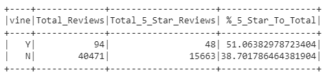

# Amazon_Vine_Analysis

## Overview
We were given access to approximately 50 datasets. Each one contains reviews of a specific product, from clothing apparel to wireless products. We were tasked to pick one of these datasets and use PySpark to perform the ETL process to extract the dataset, transform the data, connect to an AWS RDS instance, and load the transformed data into pgAdmin. Next, we were to use PySpark, Pandas, or SQL to determine if there is any bias toward favorable reviews from Vine members in our dataset. 

## Results

To begin, we took our data and filtered so that all that remaind was data that would be considered helpful to use in our analysis. We did so by dropping null values, removing data points where the number of helpful votes divded by the total number of votes was less than 50%, and determining whether or not the review was paid for using the Vine program.

As Shown above:
  * There were 94 total reviews that were created from the Vine program and 40,471 total reviews not created from vine
  * OUt of 94 reviews from Vine, 48 of them were 5 star reviews. 15,663 of the 40,471 non-Vine reviews were 5 stars/ 
  * Of all the vine reviews 51% were 5 star reviews and 37.7% were not 5 star reviews.

## Summary
According to our results, more than half of the reviews from Vine were positive. Therefore, we can conclude that there is bias on. When looking at the total number of non-Vine reviews, 38.7% were 5 star reviews. Having the larger sample size of non-Vine users will give us a more accurae depiction of what the overall customerbase's feelings are toward the product. 
The data set could benefit from having a higher quantity of Vine users review the product to see if there is inherent bias within the group. The sample size is very small, 0.002% of the total votes Vine and non_Vine users are put together, and deserves to be expanded on before a true conclusion can be reached about bias within the Vine sample. 
